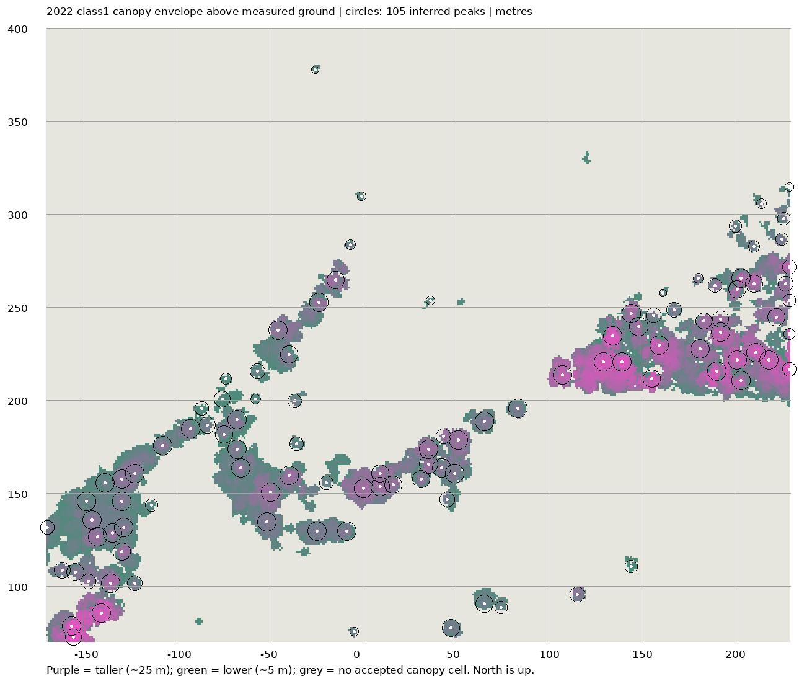

# North-context canopy evidence

The distant vegetation uses sparse elevations inferred from the cached 2022 lidar. The 2026 orthophoto confirms that the ground immediately north of headquarters contains a pond, open grass, reeds, and scattered trees. A uniform belt of tall trees across local y=73–155 m is not supported. The inferred points describe canopy-envelope peaks rather than surveyed trunks, individual trees, species, or ownership.

## Source and bounded coverage

The input is `USGS_LPC_MN_CentralMissRiver_B22_4475_49845.laz`, source ID `usgs-lidar-4475_49845` in [the acquisition manifest](../scripts/research/sources.json). Its SHA256 is `772f6ee72e6ba327d653a3a9a10f42e867884f0d748cbc8d1b7f2b54dc699436`; it contains 13,323,368 points in 74,129,464 bytes. The derivation enforces this exact hash. [USGS source tile](https://rockyweb.usgs.gov/vdelivery/Datasets/Staged/Elevation/LPC/Projects/MN_CentralMissRiver_B22/MN_CentralMissRiver_4_B22/LAZ/USGS_LPC_MN_CentralMissRiver_B22_4475_49845.laz) and [Minnesota collection metadata](https://stac.gisdata.mn.gov/collections/central-mississippi-work-units/items/cog_cm_work_4) are recorded in that manifest. Attribution: USGS 3DEP, Woolpert, NV5, and Minnesota Geospatial Information Office.

The project collection interval was 2022-04-25 through 2022-06-02; the individual tile's flight date has not been determined. Publication was 2023-09-14. No additional tile was downloaded for this analysis. Local coverage is x=-171.875..328.115 m and y=-91.836..408.154 m. The canopy analysis uses x=-170..230 m, y=70..400 m; its ground grid spans y=60..405 m. Nothing is extrapolated to y=450 m.

Coordinates use x east, y north, and z in NAVD88 GEOID18 metres minus **303.6 m**. The common numerical UTM origin is (447671.8750643735, 4984591.8364606025). Lidar is NAD83(2011)/UTM15N, EPSG 6344; the aerial is NAD83/UTM15N, EPSG 26915. Their direct numerical alignment retains potential submeter datum uncertainty.

## Derivation and review

[derive_canopy.py](../scripts/research/derive_canopy.py) reads the LAZ in chunks of 1,000,000 points. It keeps every eighth selected class 2 ground return within each chunk, then computes 5 m median bins, nearest-bin filling, and Gaussian smoothing with sigma 0.65 cells. The delivered ground grid is 81 by 70 nodes, with 67 of 5,670 bins (1.18%) marked as lacking original ground returns. It retained 474,606 ground points. Missing ground near water is interpolation, not bathymetry.

The canopy calculation retains 3,290,722 class 1 returns before height filtering. LAS class 1 means **unclassified**, not certified vegetation. It filters heights to 3–35 m above the derived ground, measures the 95th percentile in each 1 m cell, requires at least two returns and 3.5 m height per accepted cell, and removes connected patches smaller than 12 cells. A smoothed 9 by 9 m local-maximum search and 5–8 m peak suppression produce sparse candidates. Nearly flat local surfaces with a p90–p10 height spread below 0.8 m are rejected. These filters remove many small isolated returns and roof-like plateaus but cannot guarantee that every remaining object is vegetation.

Each candidate's height is the 95th percentile of accepted cell envelopes in a local 9 by 9 m window. Its crown diameter is an area-based approximation, bounded to 4–12 m by the algorithm (the delivered maximum is 10.16 m). This window can span more than one crown, or split a large crown into multiple candidates. Individual trunk position, branch structure, crown shape, leaf density and species remain illustrative.

The 105 candidates range from 4.630 to 24.715 m tall, with a median of 12.146 m. Sixty-five candidate centers fall within the cached Hennepin County/Nearmap Spring 2026 image, whose northern edge is local y=218.707745 m. An overlay inspection found that their pattern follows visible trees and shrubs and leaves the pond and principal open field clear. The cached OSM building geometry has no overlap with the northern analysis area; OSM incompleteness prevents using this as proof that no building exists. No definite building or pole false positive was identified in the aerial-covered area. The other 40 candidates have no aerial cross-check. The lidar and photograph dates differ by about four years, so removal, growth, and seasonal differences remain possible.

Three small isolated objects outside the aerial coverage are retained in the audit data but marked `scene_eligible: false`. Their identity is uncertain; omission from automatic tree placement is conservative and does not mean they are confirmed poles.

| Candidate ID | Local x, y (m) | Height (m) | Accepted local cells | Reason for omission |
|---|---:|---:|---:|---|
| north-canopy-086 | 36.5, 253.5 | 5.710 | 17 | Small isolated envelope without aerial confirmation |
| north-canopy-103 | -0.5, 309.5 | 6.172 | 17 | Small isolated envelope without aerial confirmation |
| north-canopy-105 | -25.5, 377.5 | 5.128 | 12 | Small isolated envelope near the flatness threshold, without aerial confirmation |

This leaves **102 scene-eligible canopy placements**. Ground levels among these candidates are substantially below the entrance datum; a 12 m tree in the low wetland must not be placed on the entrance platform or scaled to a uniform 20 m.



The diagnostic shows all raw candidates, including the three omitted objects. Grey means no accepted elevated class 1 canopy cell, not necessarily a complete absence of vegetation.

## Reproduction and integration

Use the Python 3.12 environment and pinned requirements described in [the research instructions](../scripts/research/README.md). After the bounded source acquisition has populated `data/research/raw`, run from the repository root:

```bash
.venv-research/bin/python scripts/research/derive_canopy.py \
  --tile data/research/raw/USGS_LPC_MN_CentralMissRiver_B22_4475_49845.laz \
  --output-dir research \
  --chunk-size 1000000
```

This command performs no network access. It writes `research/north_context_canopy_constraints.json`, `research/north_context_ground_grid.json`, and a disposable `canopy_diagnostic_cache.npz`. Keep the numpy cache out of Git. The PNG is a visual diagnostic from the recorded envelope cache, not a runtime dependency. Use the default chunk size when comparing delivered coordinates because stride sampling restarts per read chunk. The script carries the review notes from this inspected snapshot; rerunning it does not perform a new visual inspection of imagery.

For each row in `rows`, skip rows whose `scene_eligible` is false, place the asset at `position[0], position[1], ground_z`, scale its actual bottom-to-top height to `canopy_height`, and use `crown_diameter_m` only as an approximate width. `top_z` is the resulting target top elevation. The terrain array is `z[y_index][x_index]`; interpolate only inside its stated extent. Do not resample a candidate's base from an unrelated flat ground plane.

The finalized derivation was rerun against the cached hash-verified LAZ on 2026-09-07. All 105 original positions, ground elevations, canopy heights and crown widths were unchanged; the additional candidate IDs and review eligibility provide explicit integration guidance. These files constrain distant context and do not establish a tree inventory, engineering survey, legal boundary, or a current 2026 height survey.
